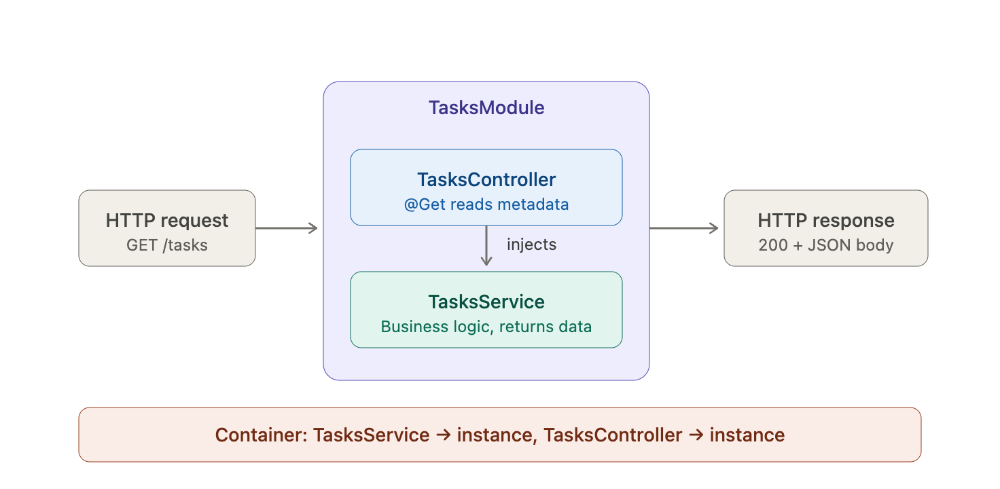

# Day 02 - NestJS Fundamentals Project Setup & TDD

> In this document, I intent to write about the concepts I have studied as part of this day's learning planner

## Learning Planner

- Task Management API - Start building backend with TDD
- Learn: NestJS architecture (modules controllers services)
- Setup: Create NestJS project with CLI
- Understand: Dependency injection in NestJS
- Learn: Decorators and metadata
- Setup: Vitest for unit testing in NestJS
- Practice: TDD approach - write test first then implementation
- Exercise: Build tasks controller with GET endpoint using TDD
- Exercise: Create TasksService with business logic following TDD
- Practice: Request/response DTOs with validation
- Learn: Exception handling in NestJS
- Exercise: Write unit tests for controller and service

## 1. NestJS Architecture (3 layer)

The main difference between the Express (Most popular Node framework) vs NestJS is it's opinionated nature. Unlike Express, that lets you put everything into a single file NestJS has three-layer split: **modules organize, controllers handle HTTP, service hold logic**.

### Modules (Organizing Unit)

A module is a class decorated **_@Module()_** that groups features that are related. It declares, what's inside controllers and services and what it should export to the other modules. By default, when a new Nest app is created it has **AppModule**, later when each feature is added, then it added **TasksModule**, **AuthModule**, **UsersModule**

**Mental model:** A module is a _boundary_. Everything inside it, shares a DI (Dependency Injection) scope. To use anything from another module, that particular module should have that item exported and we need to explicitly import the module.

The four keys in module:

```typescript
@Module({
    imports: [], // other modules that are exported that I want to use in this module
    controllers: [], // classes that handle the incoming HTTP requests
    providers: [], // injectable classes (classess, services, repositories)
    exports: [] // providers that I want to make available for others
})
```

### Controllers (the HTTP Layers)

A controller's job is simple, whenever a HTTP request is received just parse the request i.e. read the request body, parameters - query and path and call the respective service, return the response.

Ideally, controllers should be boring and shouldn't have any business logic written inside them.

```typescript
@Controller('tasks')
export class TasksController {
  constructor(private readonly tasksService: TasksService) {}

  @Get()
  findAll() {
    return this.tasksService.findAll();
  }

  @Post()
  create(@Body() dto: CreateTaskDto) {
    return this.tasksService.create(dto);
  }
}
```

The decorators do the routing:

- **@Controller('tasks')**, mounts everything under **/tasks**
- **@Get()**, handle the **GET** requests
- **@Post()**, handle the **POST** requests
- **Body()**, extracts the parsed JSON from the request

**_Note:_** The controller doesn't know about Express or Fastify underneath — Nest abstracts the HTTP layer so the same controller works regardless of platform.

### Services (Logic layers)

The services is the place where the business logic lives. They're plain classes marked with **@Injectable** decorator so that Nest can manage their lifecycle. They don't know about the HTTP, as they take the input, apply the validation logic or rules written, return the output.

This is also one of the best things that makes them easier to test, as we don't need to spin up a HTTP server to verify your validation logic.

```typescript
@Injectable()
export class TasksService {
  private tasks: Task[] = [];

  findAll(): Task[] {
    return this.tasks;
  }

  create(dto: CreateTaskDto): Task {
    const task = { id: uuid(), ...dto, status: 'OPEN' };
    this.tasks.push(task);
    return task;
  }
}
```

### Why this split matters (3 layers)

Each layer changes for a different reasons

- Controller changes when the API contract changes (new endpoint, different request method or status code)
- Service changes when the business rules change (new validation, different workflow)
- Modules changes when the reorganization of features (split into sub-modules, new dependencies)

As all of them are separate, change to one rarely hampers others

## 2. Dependency Injection

DI is the part that takes longest to internalize or understand because it looks like a magic. The trick is simpler:

- Classes declare what they need, instead of constructing it
- Container provided the instances required by the classes, by looking them up in a Map.

### Without DI

```typescript
class TasksController {
  private service = new TasksService();
}
```

It looks innocent, but problems showup later:

- How to test the controller without the real service?
- How to swap the in-memory service with database-backed one, in case we are using a DB.

Here, the issue is the controller being tightly-coupled to a specfic service or implementation

### DI way

```typescript
class TasksController {
  constructor(private readonly service: TasksService)
}
```

Here, The controller no longer constructs the service — it declares _"I need a TasksService"_ via its constructor signature. Something else is responsible for handing one in. That something is Nest's **DI container**.

### How the container actually works

At its core, the container is a **Map<token, instance>**. When Nest starts, it looks up your module graph, sees every class in providers, and registers it:

```typescript
container = {
    TasksService: <TasksService instance>,    // resolved by token
    LoggerService: <LoggerService instance>,
    TasksController: <TasksController instance>,
}
```

When it needs to construct TasksController, it reads the constructor parameter types, sees it needs a TasksService, looks up that key in the map, and passes the instance to new TasksController(...). Every dependency is resolved by token lookup.

### How Nest knows the constructor needs a particular service?

This is where decorators and TypeScript cooperate. With _emitDecoratorMetadata: true_ in your tsconfig.json, TypeScript writes constructor parameter types into a hidden metadata table on the class at compile time. Nest reads that table at runtime using the **reflect-metadata** library:

```typescript
Reflect.getMetadata('design:paramtypes', TasksController);
// → [class TasksService]
```

That's the entire mechanism. The decorator (**@Injectable()**, **@Controller()**) is the trigger that tells TypeScript _"this class participates in DI, write its types down."_ Without **emitDecoratorMetadata**, that table is empty, and Nest has no idea what to inject. This is exactly why we needed **SWC** over **esbuild** in your **Vitest** setup — esbuild doesn't emit this metadata correctly, which would silently break every test that relies on DI.

## 3. Decorators & Metadata

Decorators are relatively new to **JavaScript** world and they feel like similar to **Python** annotations which is not true. _A decorator is a function that gets called when the class is defined, and it's only job is to attach the metadata to the class_. The metadata attached, gets read later by the framework i.e. NestJS in our case to make decisions about the behavior.

### What a decorator actually is (Custom Decorator)

```typescript
function MyDecorator(target: any) {
  Reflect.defineMetadata('my:flag', true, target);
}

@MyDecorator
class Foo {}

Reflect.getMetadata('my:flag', Foo); // → true
```

That's it. The decorator doesn't transform Foo, doesn't rewrite its constructor, doesn't generate code. It runs once at class-definition time and writes a key-value pair into a hidden table. Anyone with a reference to Foo can read that table later.

### 3 kinds of Decorators in Nest

#### Class Decorators

- **@Controller**: This controller is mounted at _/tasks_
- **@Injectable**: This is injectable
- **@Module**: This module contains these providers

#### Method Decorators

**@Get**, **@Post**, **@Delete** as per the request methods. Internally, Nest scans the controller class at the startup, reads each methods metadata, and builds the route table.

#### Parameter Decorators

**@Body**, **@Query**, **@Param** as per the request, Nest reads the parameter metadata and pulls the right value out of the request object.

### Composable Decorators

Multiple decorators stack on the same target:

```typescript
@Controller('tasks') // class decorator: route prefix
export class TasksController {
  @Get(':id') // method decorator: GET /tasks/:id
  findOne(
    @Param('id') id: string, // parameter decorator: extract URL param
  ): Task {
    return this.service.findOne(id);
  }
}
```

Each decorator runs independently and writes its own metadata key. Nest reads all of them at startup to wire up routing, parameter extraction, validation pipes, guards, interceptors — everything.

### Mental Paradigm

Coming from React or Express, you're used to behavior being defined by what you do — call this function, return this value, await this promise. Decorators flip that: _behavior is defined by what you declare_. **@Get(':id')** doesn't do anything by itself; it just marks the method. Nest is the one that later says _"Aha, this method is marked as a **GET** handler, let me route requests to it."_

This is the same pattern as HTML attributes.

```html
<input type="email" />
```

It doesn't do anything on its own — the browser reads the attribute and decides to render an email input with built-in validation. Decorators are runtime attributes on classes.
Here's a quick visual of how the three pieces fit together at runtime:


